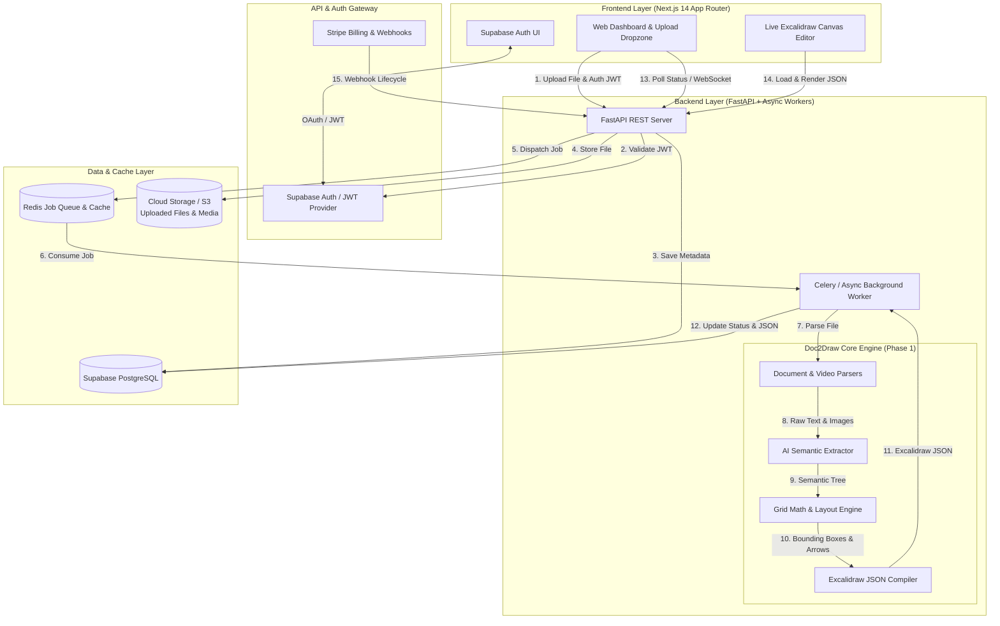

# 🚀 Doc2Draw AI — Complete End-to-End Master Blueprint & Full-Stack Implementation Guide
**The Definitive Engineering Specification for Phase 1, Phase 2, Phase 3, Phase 4, and DevOps**

---

## 📋 Table of Contents
1. [Executive Summary & Product Vision](#1-executive-summary--product-vision)
2. [Target Audience & Use Cases](#2-target-audience--use-cases)
3. [End-to-End System Architecture & Data Pipeline](#3-end-to-end-system-architecture--data-pipeline)
4. [Phase 1: Core Python Engine & CLI MVP (`doc2draw-core`)](#4-phase-1-core-python-engine--cli-mvp-doc2draw-core)
   - [4.1 Package Architecture & Module Layout](#41-package-architecture--module-layout)
   - [4.2 Intelligent Document & Media Ingestion](#42-intelligent-document--media-ingestion)
   - [4.3 AI Semantic Structuring Engine & Pydantic Schemas](#43-ai-semantic-structuring-engine--pydantic-schemas)
   - [4.4 Deterministic Grid Layout Math & JSON Compiler](#44-deterministic-grid-layout-math--json-compiler)
5. [Phase 2: FastAPI Backend & REST API Engineering (`backend/`)](#5-phase-2-fastapi-backend--rest-api-engineering-backend)
   - [5.1 Backend Directory Structure](#51-backend-directory-structure)
   - [5.2 Core Pydantic Request/Response Schemas](#52-core-pydantic-requestresponse-schemas)
   - [5.3 REST API Endpoints Specification](#53-rest-api-endpoints-specification)
   - [5.4 Asynchronous Celery Worker Pipeline](#54-asynchronous-celery-worker-pipeline)
6. [Phase 3: Next.js 14 Frontend Web Application (`frontend/`)](#6-phase-3-nextjs-14-frontend-web-application-frontend)
   - [6.1 Frontend Directory Structure & App Router Setup](#61-frontend-directory-structure--app-router-setup)
   - [6.2 Dynamic Excalidraw Canvas Wrapper (`@excalidraw/excalidraw`)](#62-dynamic-excalidraw-canvas-wrapper-excalidrawexcalidraw)
   - [6.3 Real-Time Job Polling Hook (`useProjectStatus`)](#63-real-time-job-polling-hook-useprojectstatus)
7. [Phase 4: Database Schema, Supabase Auth & Stripe Monetization](#7-phase-4-database-schema-supabase-auth--stripe-monetization)
   - [7.1 Complete PostgreSQL DDL Schema & RLS Policies](#71-complete-postgresql-ddl-schema--rls-policies)
   - [7.2 Stripe Webhook Integration & Lifecycle Handling](#72-stripe-webhook-integration--lifecycle-handling)
8. [Phase 5: DevOps, Dockerization & Cloud Deployment](#8-phase-5-devops-dockerization--cloud-deployment)
   - [8.1 Multi-Stage Backend Dockerfile (with OpenCV & PDF tools)](#81-multi-stage-backend-dockerfile-with-opencv--pdf-tools)
   - [8.2 Docker Compose for Local Full-Stack Development](#82-docker-compose-for-local-full-stack-development)
   - [8.3 Production Cloud Infrastructure Blueprint](#83-production-cloud-infrastructure-blueprint)
9. [💰 Monetization & Pricing Strategy](#9--monetization--pricing-strategy)
10. [🔮 Future Enhancements & Roadmap](#10--future-enhancements--roadmap)
11. [🛠️ Step-by-Step Execution Checklist](#11-️-step-by-step-execution-checklist)

---

## 1. Executive Summary & Product Vision

**Doc2Draw AI** is an AI-powered document-to-diagram visualization platform designed for course creators, technical writers, consultants, and developers. 

Converting unstructured text (such as Word documents, course transcripts, or technical specifications) into structured, visually engaging diagrams traditionally requires hours of manual drafting, layout alignment, and design tweaking. **Doc2Draw AI** automates this entire pipeline by combining intelligent document parsing, video/image frame extraction, LLM-powered semantic layout structuring, and programmatic Excalidraw JSON compilation.

### ✨ Key Value Propositions
* **⚡ 10x Faster Content Creation:** Convert a 30-page course blueprint into a 10-chapter interactive visual map in under 60 seconds.
* **🎨 Studio-Grade Aesthetics:** Automated color harmony, typography pairing, grid alignment, and visual containerization that looks professionally designed by a UI/UX architect.
* **🖼️ Multimodal Asset Integration:** Automatically extract key video frames or embed reference screenshots directly onto the visual canvas.
* **🔗 Universal Compatibility:** Export natively to `.excalidraw` (editable in Excalidraw or Obsidian), high-resolution `.png`, `.svg`, or share via interactive web links.

---

## 2. Target Audience & Use Cases

| Target Segment | Pain Point | How Doc2Draw AI Solves It |
| :--- | :--- | :--- |
| **🎓 Course Creators & Educators** | Need visual summaries and cheat sheets for masterclasses but lack design time/skills. | Ingests course syllabus/transcripts (`.docx`) and lecture videos (`.mp4`) to auto-generate complete chapter-by-chapter visual maps. |
| **🏗️ Solution Architects & Devs** | Technical specs and PRDs are dense and hard for stakeholders to digest quickly. | Converts PRDs, technical RFCs, and architecture docs into clean system architecture diagrams and flowcharts. |
| **📊 Business Analysts & PMs** | Meeting notes and process documentation get buried in text files. | Transforms SOPs (Standard Operating Procedures) and workflow documents into swimlane diagrams and step-by-step visual process pipelines. |
| **💼 Agencies & Consultants** | Spending unbillable hours building client slide decks and visual roadmaps. | Instantly generates client-ready visual roadmaps and strategic framework diagrams from rough discovery call notes. |

---

## 3. End-to-End System Architecture & Data Pipeline

The system operates as an asynchronous, multi-stage processing pipeline that transforms raw unstructured files into validated, pixel-perfect Excalidraw JSON schemas, delivered through a modern web SaaS interface.



---

## 4. Phase 1: Core Python Engine & CLI MVP (`doc2draw-core`)

Phase 1 establishes the foundational AI and layout math engine that converts unstructured documents and video files into validated Excalidraw schemas without needing a browser or database.

### 4.1 Package Architecture & Module Layout
```text
doc2draw-core/
├── doc2draw/
│   ├── __init__.py
│   ├── parsers/
│   │   ├── __init__.py
│   │   ├── docx_parser.py        # Extracts text, headings, and lists from Word .docx
│   │   ├── pdf_parser.py         # Extracts structured text and layout from PDF
│   │   └── media_parser.py       # OpenCV & FFmpeg video frame extraction
│   ├── ai/
│   │   ├── __init__.py
│   │   ├── schemas.py            # Pydantic models for structured LLM output
│   │   └── extractor.py          # LangChain / Instructor LLM semantic extraction
│   ├── layout/
│   │   ├── __init__.py
│   │   └── grid_engine.py        # Deterministic 2D coordinate & collision math
│   └── compiler/
│       ├── __init__.py
│       └── excalidraw_compiler.py # Compiles elements into standard Excalidraw v2 JSON
├── tests/
│   ├── test_parsers.py
│   ├── test_layout.py
│   └── test_compiler.py
└── pyproject.toml
```

### 4.2 Intelligent Document & Media Ingestion
* **Text Parser (`docx_parser.py` / `pdf_parser.py`):** Extracts hierarchical structure (`H1`, `H2`, `H3`), bullet lists, bold emphasis, and tables using `python-docx` and `pdfplumber`, ensuring section headers are preserved for AI chapter grouping.
* **Media Processor (`media_parser.py`):**
  * Ingests `.mp4` files or video streams.
  * Calculates total duration and extracts high-clarity keyframes at evenly distributed percentage intervals (10%, 25%, 50%, 75%, 90%) or via OpenCV scene-change detection.
  * Resizes screenshots to a maximum width of 800px and compresses to JPEG quality 85 to ensure the final Base64-encoded JSON payload remains lightweight (< 5MB).

### 4.3 AI Semantic Structuring Engine & Pydantic Schemas
Instead of asking an LLM to generate raw Excalidraw coordinates directly (which LLMs struggle with due to spatial floating-point math limitations), we prompt the LLM to output a **Semantic Diagram Tree**.

> [!IMPORTANT]
> **Key Architectural Pattern:** The LLM decides *WHAT* to draw and *HOW items relate* (Chapters, Topics, Arrows, Cards). Our deterministic Python Grid Engine decides *WHERE* to draw them (exact X, Y coordinates, widths, heights, and routing).

#### Pydantic Schema (`doc2draw/ai/schemas.py`):
```python
from pydantic import BaseModel, Field
from typing import List, Optional

class DiagramItem(BaseModel):
    id: str = Field(..., description="Unique identifier, e.g., 'item_1'")
    title: str = Field(..., description="Short title or heading of the card")
    bullet_points: List[str] = Field(..., description="3 to 5 key takeaway points")
    category_color: str = Field(..., description="Color theme: 'blue', 'green', 'purple', 'orange', 'red'")
    connected_to: Optional[List[str]] = Field(default=[], description="IDs of items this should connect to via arrows")
    screenshot_ref: Optional[str] = Field(default=None, description="Name of associated screenshot if applicable")

class DiagramStructure(BaseModel):
    title: str = Field(..., description="Main title of the entire masterclass/document")
    subtitle: str = Field(..., description="One-line summary subtitle")
    layout_style: str = Field(..., description="Layout type: 'multi_column_grid', 'flowchart_pipeline', 'mindmap_tree'")
    items: List[DiagramItem]
```

### 4.4 Deterministic Grid Layout Math & JSON Compiler
Takes the structured JSON from the LLM and calculates precise coordinates without overlap:
1. **Grid Calculation (`grid_engine.py`):** For a `multi_column_grid`, divides items into `N` vertical columns (default 2 or 3) with `COLUMN_WIDTH = 450`, `COLUMN_GAP = 80`, and `ROW_GAP = 60`.
2. **Dynamic Height Calculation:** Calculates container height dynamically based on the number of bullet points and text wrapping lines: `height = 80 + (num_lines * 24) + padding`.
3. **Arrow Routing:** Automatically computes start and end points between bounding boxes (`start_x = box1.x + box1.width`, `end_x = box2.x`), adding elegant curved routing (`roundness: { type: 2 }`).
4. **Asset Binding & Compilation (`excalidraw_compiler.py`):** Converts local/extracted screenshot images into Base64 strings and injects them into the Excalidraw `files` dictionary with generated `fileId` references, producing the final schema:

```json
{
  "type": "excalidraw",
  "version": 2,
  "source": "https://doc2draw.ai",
  "elements": [ ... ],
  "appState": {
    "viewBackgroundColor": "#ffffff",
    "gridSize": 20,
    "theme": "light"
  },
  "files": {
    "file_id_1": {
      "mimeType": "image/jpeg",
      "id": "file_id_1",
      "dataURL": "data:image/jpeg;base64,/9j/4AAQSkZJRg..."
    }
  }
}
```

---

## 5. Phase 2: FastAPI Backend & REST API Engineering (`backend/`)

The backend exposes RESTful endpoints for file uploading, asynchronous AI diagram generation, job polling, and diagram retrieval, wrapping the Phase 1 Core Engine.

### 5.1 Backend Directory Structure
```text
backend/
├── app/
│   ├── __init__.py
│   ├── main.py                   # FastAPI application entrypoint & middleware
│   ├── config.py                 # Environment variables & settings (Pydantic BaseSettings)
│   ├── api/
│   │   ├── __init__.py
│   │   ├── v1/
│   │   │   ├── router.py         # Main API v1 router
│   │   │   ├── endpoints/
│   │   │   │   ├── projects.py   # Upload, Generate, Status, Excalidraw endpoints
│   │   │   │   ├── webhooks.py   # Stripe payment webhooks
│   │   │   │   └── users.py      # User profile & usage quotas
│   ├── core/
│   │   ├── __init__.py
│   │   ├── auth.py               # Supabase JWT authentication dependency
│   │   ├── exceptions.py         # Custom HTTP exceptions & error handlers
│   │   └── security.py           # API key & CORS security
│   ├── services/
│   │   ├── __init__.py
│   │   ├── generator_service.py # Bridges FastAPI with doc2draw core package
│   │   ├── storage_service.py   # S3 / Supabase Storage file handler
│   │   └── billing_service.py   # Stripe customer & quota management
│   ├── workers/
│   │   ├── __init__.py
│   │   └── tasks.py              # Celery / Asyncio background worker tasks
│   └── models/
│       ├── __init__.py
│       ├── schemas.py            # Pydantic request/response schemas
│       └── db_models.py          # SQLAlchemy / SQLModel database models
├── tests/
│   ├── test_api.py
│   └── test_workers.py
├── Dockerfile
├── requirements.txt
└── pyproject.toml
```

### 5.2 Core Pydantic Request/Response Schemas (`backend/app/models/schemas.py`)
```python
from pydantic import BaseModel, Field
from typing import Optional, List, Dict, Any
from datetime import datetime
from enum import Enum

class JobStatusEnum(str, Enum):
    QUEUED = "queued"
    PROCESSING = "processing"
    DONE = "done"
    ERROR = "error"

class ProjectUploadResponse(BaseModel):
    project_id: str
    filename: str
    file_type: str
    file_size_bytes: int
    uploaded_at: datetime

class GenerateRequest(BaseModel):
    project_id: str
    title: Optional[str] = None
    columns: int = Field(default=2, ge=1, le=5)
    layout_style: str = Field(default="multi_column_grid")
    ai_model_provider: str = Field(default="claude-3-5-sonnet")

class GenerateResponse(BaseModel):
    job_id: str
    project_id: str
    status: JobStatusEnum
    estimated_time_sec: int

class JobStatusResponse(BaseModel):
    job_id: str
    project_id: str
    status: JobStatusEnum
    progress: int = Field(default=0, ge=0, le=100)
    result_available: bool
    chapters_extracted: int = 0
    error_message: Optional[str] = None

class ExcalidrawResponse(BaseModel):
    project_id: str
    title: str
    type: str = "excalidraw"
    version: int = 2
    source: str = "doc2draw-ai"
    elements: List[Dict[str, Any]]
    appState: Dict[str, Any]
    files: Dict[str, Any]
```

### 5.3 REST API Endpoints Specification

#### `POST /api/v1/projects/upload`
* **Description**: Accepts multipart/form-data file uploads (`.docx`, `.pdf`, `.mp4`, `.png`, `.jpg`, `.md`).
* **Logic**:
  1. Validate JWT Bearer token via `auth.py`.
  2. Check user's monthly upload quota against Supabase DB.
  3. Validate MIME type and file size limit (Max 50MB for Free, 500MB for Pro).
  4. Upload raw file to Supabase Storage / S3 bucket under `projects/{user_id}/{project_id}/{filename}`.
  5. Insert project metadata record into PostgreSQL `projects` table.
* **Returns**: `ProjectUploadResponse` (200 OK) or `415 Unsupported Media Type` / `429 Too Many Requests`.

#### `POST /api/v1/projects/generate`
* **Description**: Triggers background AI parsing and diagram layout compilation.
* **Logic**:
  1. Verify project ownership and ensure file exists.
  2. Create a job record in `jobs` table with status `QUEUED`.
  3. Dispatch background task: `tasks.process_project_generation.delay(job_id, project_id, config)`.
* **Returns**: `GenerateResponse` with `job_id`.

#### `GET /api/v1/projects/{job_id}/status`
* **Description**: Polling endpoint for frontend progress bars.
* **Logic**:
  1. Query `jobs` table by `job_id`.
  2. Return real-time progress percentage (`0%` -> `25% Parsing` -> `60% AI Structuring` -> `90% Grid Layout` -> `100% Done`).
* **Returns**: `JobStatusResponse`.

#### `GET /api/v1/projects/{project_id}/excalidraw`
* **Description**: Retrieves final Excalidraw JSON for rendering.
* **Logic**:
  1. Verify project status is `DONE`.
  2. Fetch compiled JSON from storage or DB column.
  3. Inject dynamic `appState` (viewBackgroundColor, zoom, scrollX, scrollY).
* **Returns**: Complete Excalidraw JSON schema compatible with `@excalidraw/excalidraw`.

### 5.4 Asynchronous Celery Worker Pipeline (`backend/app/workers/tasks.py`)
```python
from celery import Celery
from doc2draw.parsers.docx_parser import parse_docx
from doc2draw.parsers.pdf_parser import parse_pdf
from doc2draw.parsers.media_parser import parse_media
from doc2draw.ai.extractor import rule_based_extract # or llm_extract
from doc2draw.layout.grid_engine import GridEngine
from doc2draw.compiler.excalidraw_compiler import compile_to_excalidraw_json
import json

celery_app = Celery("doc2draw_worker", broker="redis://localhost:6379/0")

@celery_app.task(bind=True)
def process_project_generation(self, job_id: str, project_id: str, config: dict):
    try:
        # Step 1: Update status to PROCESSING (Progress: 10%)
        update_job_status(job_id, status="processing", progress=10)
        
        # Step 2: Download file from Storage
        file_path, file_type = download_file_from_storage(project_id)
        
        # Step 3: Parse Document / Video (Progress: 35%)
        update_job_status(job_id, progress=35)
        if file_type == "docx":
            raw_text = parse_docx(file_path)
        elif file_type == "pdf":
            raw_text = parse_pdf(file_path)
        elif file_type in ("mp4", "jpg", "png"):
            raw_text, images = parse_media(file_path)
        else:
            with open(file_path, "r", encoding="utf-8") as f:
                raw_text = f.read()
                
        # Step 4: AI Semantic Extraction (Progress: 65%)
        update_job_status(job_id, progress=65)
        structure = rule_based_extract(raw_text, title=config.get("title", "Untitled Project"))
        
        # Step 5: Grid Math Layout & Compilation (Progress: 90%)
        update_job_status(job_id, progress=90)
        engine = GridEngine(max_cols=config.get("columns", 2))
        elements, files_dict = engine.generate_layout(structure)
        excalidraw_json_str = compile_to_excalidraw_json(structure)
        
        # Step 6: Save Result & Mark Done (Progress: 100%)
        save_result_to_db(project_id, json.loads(excalidraw_json_str))
        update_job_status(job_id, status="done", progress=100, chapters=len(structure.items))
        
    except Exception as e:
        update_job_status(job_id, status="error", progress=0, error_message=str(e))
        raise e
```

---

## 6. Phase 3: Next.js 14 Frontend Web Application (`frontend/`)

### 6.1 Frontend Directory Structure & App Router Setup
```text
frontend/
├── src/
│   ├── app/
│   │   ├── layout.tsx            # Root layout with Supabase Auth Provider & Theme
│   │   ├── page.tsx              # Marketing Landing Page (Hero, Features, Pricing)
│   │   ├── (auth)/
│   │   │   ├── login/page.tsx    # Supabase Login UI
│   │   │   └── register/page.tsx # Registration UI
│   │   ├── dashboard/
│   │   │   ├── layout.tsx        # Dashboard sidebar & top navbar
│   │   │   ├── page.tsx          # Project list & recent diagrams
│   │   │   └── new/page.tsx      # Upload Dropzone & Configuration Wizard
│   │   └── editor/
│   │       └── [projectId]/
│   │           └── page.tsx      # Live Excalidraw Canvas Editor Page
│   ├── components/
│   │   ├── ui/                   # Shadcn UI reusable components (Button, Modal, Card)
│   │   ├── upload/
│   │   │   └── FileDropzone.tsx  # Drag & drop upload component with progress bar
│   │   ├── canvas/
│   │   │   ├── ExcalidrawWrapper.tsx # Client-side dynamic import of @excalidraw/excalidraw
│   │   │   ├── CustomToolbar.tsx # Export, Share, and AI Re-layout controls
│   │   │   └── AIAssistantDrawer.tsx # Sidebar prompt editor for diagram modifications
│   │   └── dashboard/
│   │       └── ProjectCard.tsx   # Project thumbnail card with status badge
│   ├── lib/
│   │   ├── api.ts                # Axios / Fetch client configured with API Base URL & JWT
│   │   ├── supabase.ts           # Supabase client SDK initialization
│   │   └── utils.ts              # Tailwind class merger (cn) & formatting helpers
│   └── hooks/
│       ├── useProjectStatus.ts   # SWR / React Query polling hook for job status
│       └── useExcalidraw.ts      # Canvas state & export handlers
├── public/
├── package.json
├── tailwind.config.ts
└── tsconfig.json
```

### 6.2 Dynamic Excalidraw Canvas Wrapper (`src/components/canvas/ExcalidrawWrapper.tsx`)
Because `@excalidraw/excalidraw` relies on browser DOM APIs (`canvas`, `window`), it must be dynamically imported with SSR disabled in Next.js App Router:

```tsx
"use client";

import React, { useEffect, useState } from "react";
import dynamic from "next/dynamic";
import { useTheme } from "next-themes";

// Dynamically import Excalidraw without Server-Side Rendering
const Excalidraw = dynamic(
  async () => (await import("@excalidraw/excalidraw")).Excalidraw,
  { ssr: false }
);

interface ExcalidrawWrapperProps {
  initialData: any;
  onSave?: (elements: any, appState: any, files: any) => void;
}

export default function ExcalidrawWrapper({ initialData, onSave }: ExcalidrawWrapperProps) {
  const { theme } = useTheme();
  const [excalidrawAPI, setExcalidrawAPI] = useState<any>(null);

  useEffect(() => {
    if (excalidrawAPI && initialData) {
      excalidrawAPI.updateScene({
        elements: initialData.elements || [],
        appState: {
          ...initialData.appState,
          theme: theme === "dark" ? "dark" : "light",
          viewBackgroundColor: theme === "dark" ? "#121212" : "#ffffff",
        },
        files: initialData.files || {},
      });
    }
  }, [excalidrawAPI, initialData, theme]);

  return (
    <div className="w-full h-[calc(100vh-64px)] border rounded-lg overflow-hidden shadow-sm">
      <Excalidraw
        excalidrawAPI={(api) => setExcalidrawAPI(api)}
        initialData={initialData}
        onChange={(elements, appState, files) => {
          if (onSave) onSave(elements, appState, files);
        }}
        UIOptions={{
          canvasActions: {
            loadScene: false,
            saveToActiveFile: false,
            export: { saveFileToDisk: true },
          },
        }}
      />
    </div>
  );
}
```

### 6.3 Real-Time Job Polling Hook (`src/hooks/useProjectStatus.ts`)
```ts
import useSWR from "swr";
import { apiClient } from "@/lib/api";

const fetcher = (url: string) => apiClient.get(url).then((res) => res.data);

export function useProjectStatus(jobId: string | null) {
  const { data, error, mutate } = useSWR(
    jobId ? `/api/v1/projects/${jobId}/status` : null,
    fetcher,
    {
      refreshInterval: (data) => {
        // Stop polling if job is done or failed
        if (data && (data.status === "done" || data.status === "error")) {
          return 0;
        }
        return 1000; // Poll every 1 second
      },
    }
  );

  return {
    status: data?.status,
    progress: data?.progress || 0,
    chapters: data?.chapters_extracted || 0,
    isDone: data?.status === "done",
    isError: data?.status === "error",
    errorMessage: data?.error_message,
    refresh: mutate,
  };
}
```

---

## 7. Phase 4: Database Schema, Supabase Auth & Stripe Monetization

### 7.1 Complete PostgreSQL DDL Schema & RLS Policies
Execute this script in your Supabase SQL Editor to set up tables, foreign keys, and Row Level Security (RLS):

```sql
-- Enable UUID extension
CREATE EXTENSION IF NOT EXISTS "uuid-ossp";

-- 1. USERS & SUBSCRIPTIONS TABLE
CREATE TABLE public.profiles (
    id UUID PRIMARY KEY REFERENCES auth.users(id) ON DELETE CASCADE,
    email TEXT UNIQUE NOT NULL,
    full_name TEXT,
    avatar_url TEXT,
    stripe_customer_id TEXT UNIQUE,
    subscription_tier TEXT DEFAULT 'free' CHECK (subscription_tier IN ('free', 'pro', 'team')),
    subscription_status TEXT DEFAULT 'active',
    monthly_upload_count INT DEFAULT 0,
    quota_reset_date TIMESTAMPTZ DEFAULT NOW() + INTERVAL '1 month',
    created_at TIMESTAMPTZ DEFAULT NOW(),
    updated_at TIMESTAMPTZ DEFAULT NOW()
);

-- 2. PROJECTS TABLE
CREATE TABLE public.projects (
    id UUID PRIMARY KEY DEFAULT uuid_generate_v4(),
    user_id UUID NOT NULL REFERENCES public.profiles(id) ON DELETE CASCADE,
    title TEXT NOT NULL,
    original_filename TEXT NOT NULL,
    file_type TEXT NOT NULL,
    file_size_bytes BIGINT NOT NULL,
    storage_path TEXT NOT NULL,
    status TEXT DEFAULT 'queued' CHECK (status IN ('queued', 'processing', 'done', 'error')),
    columns_config INT DEFAULT 2,
    layout_style TEXT DEFAULT 'multi_column_grid',
    excalidraw_json JSONB,
    created_at TIMESTAMPTZ DEFAULT NOW(),
    updated_at TIMESTAMPTZ DEFAULT NOW()
);

-- 3. BACKGROUND JOBS TABLE
CREATE TABLE public.jobs (
    id UUID PRIMARY KEY DEFAULT uuid_generate_v4(),
    project_id UUID NOT NULL REFERENCES public.projects(id) ON DELETE CASCADE,
    status TEXT DEFAULT 'queued',
    progress INT DEFAULT 0,
    chapters_extracted INT DEFAULT 0,
    error_message TEXT,
    started_at TIMESTAMPTZ DEFAULT NOW(),
    completed_at TIMESTAMPTZ
);

-- 4. ROW LEVEL SECURITY (RLS) POLICIES
ALTER TABLE public.profiles ENABLE ROW LEVEL SECURITY;
ALTER TABLE public.projects ENABLE ROW LEVEL SECURITY;
ALTER TABLE public.jobs ENABLE ROW LEVEL SECURITY;

-- Profiles: Users can read and update only their own profile
CREATE POLICY "Users can view own profile" ON public.profiles
    FOR SELECT USING (auth.uid() = id);

CREATE POLICY "Users can update own profile" ON public.profiles
    FOR UPDATE USING (auth.uid() = id);

-- Projects: Users can CRUD only their own projects
CREATE POLICY "Users can manage own projects" ON public.projects
    FOR ALL USING (auth.uid() = user_id);

-- Jobs: Users can view jobs for their projects
CREATE POLICY "Users can view own project jobs" ON public.jobs
    FOR SELECT USING (
        EXISTS (
            SELECT 1 FROM public.projects 
            WHERE projects.id = jobs.project_id AND projects.user_id = auth.uid()
        )
    );
```

### 7.2 Stripe Webhook Integration & Lifecycle Handling (`backend/app/api/v1/endpoints/webhooks.py`)
To handle automated subscription upgrades and cancellations:

```python
from fastapi import APIRouter, Request, Header, HTTPException
import stripe
import os
from app.services.billing_service import update_user_subscription

router = APIRouter()
stripe.api_key = os.getenv("STRIPE_SECRET_KEY")
WEBHOOK_SECRET = os.getenv("STRIPE_WEBHOOK_SECRET")

@router.post("/stripe")
async def stripe_webhook(request: Request, stripe_signature: str = Header(None)):
    payload = await request.body()
    try:
        event = stripe.Webhook.construct_event(
            payload, stripe_signature, WEBHOOK_SECRET
        )
    except ValueError:
        raise HTTPException(status_code=400, detail="Invalid payload")
    except stripe.error.SignatureVerificationError:
        raise HTTPException(status_code=400, detail="Invalid signature")

    event_type = event["type"]
    data_object = event["data"]["object"]

    if event_type == "checkout.session.completed":
        customer_id = data_object.get("customer")
        client_reference_id = data_object.get("client_reference_id") # auth.user id
        # Upgrade user to Pro or Team tier
        await update_user_subscription(
            user_id=client_reference_id,
            stripe_customer_id=customer_id,
            tier="pro",
            status="active"
        )
    elif event_type in ("customer.subscription.deleted", "customer.subscription.updated"):
        customer_id = data_object.get("customer")
        status = data_object.get("status")
        tier = "free" if status != "active" else "pro"
        await update_user_subscription(
            stripe_customer_id=customer_id,
            tier=tier,
            status=status
        )

    return {"status": "success"}
```

---

## 8. Phase 5: DevOps, Dockerization & Cloud Deployment

### 8.1 Multi-Stage Backend Dockerfile (with OpenCV & PDF tools)
```dockerfile
FROM python:3.11-slim

WORKDIR /app

# Install system dependencies (required for OpenCV video parsing & PDF tools)
RUN apt-get update && apt-get install -y --no-install-recommends \
    build-essential \
    libgl1-mesa-glx \
    libglib2.0-0 \
    && rm -rf /var/lib/apt/lists/*

COPY requirements.txt .
RUN pip install --no-cache-dir -r requirements.txt

COPY . .

EXPOSE 8000

# Start FastAPI server using Uvicorn
CMD ["uvicorn", "app.main:app", "--host", "0.0.0.0", "--port", "8000", "--workers", "4"]
```

### 8.2 Docker Compose for Local Full-Stack Development (`docker-compose.yml`)
```yaml
version: '3.8'

services:
  backend:
    build: ./backend
    ports:
      - "8000:8000"
    environment:
      - SUPABASE_URL=${SUPABASE_URL}
      - SUPABASE_SERVICE_ROLE_KEY=${SUPABASE_SERVICE_ROLE_KEY}
      - REDIS_URL=redis://redis:6379/0
      - STRIPE_SECRET_KEY=${STRIPE_SECRET_KEY}
    depends_on:
      - redis
    volumes:
      - ./backend:/app

  worker:
    build: ./backend
    command: celery -A app.workers.tasks.celery_app worker --loglevel=info
    environment:
      - SUPABASE_URL=${SUPABASE_URL}
      - SUPABASE_SERVICE_ROLE_KEY=${SUPABASE_SERVICE_ROLE_KEY}
      - REDIS_URL=redis://redis:6379/0
    depends_on:
      - redis
    volumes:
      - ./backend:/app

  redis:
    image: redis:7-alpine
    ports:
      - "6379:6379"

  frontend:
    build:
      context: ./frontend
      dockerfile: Dockerfile
    ports:
      - "3000:3000"
    environment:
      - NEXT_PUBLIC_API_URL=http://localhost:8000
      - NEXT_PUBLIC_SUPABASE_URL=${SUPABASE_URL}
      - NEXT_PUBLIC_SUPABASE_ANON_KEY=${SUPABASE_ANON_KEY}
    depends_on:
      - backend
```

### 8.3 Production Cloud Infrastructure Blueprint
1. **Frontend (Next.js 14)**: Deploy on **Vercel** or **Cloudflare Pages** for global CDN caching and automatic SSL.
2. **Backend (FastAPI + Celery)**: Deploy on **Render**, **Railway**, or **AWS ECS (Fargate)**. A dedicated container with at least 2GB RAM is recommended to handle OpenCV video frame extraction and PDF image processing without memory exhaustion.
3. **Database & Auth**: **Supabase** (Managed PostgreSQL + GoTrue Auth + S3-compatible Blob Storage).
4. **Queue/Cache**: **Upstash Redis** or **Render Managed Redis** for Celery background job coordination.

---

## 9. 💰 Monetization & Pricing Strategy

| Tier | Price | Features & Usage Limits | Target User |
| :--- | :--- | :--- | :--- |
| **🌱 Starter (Free)** | **$0 / mo** | • 3 Diagrams / month<br>• Word & Text upload only<br>• Standard Grid Layout<br>• Community Support | Casual users & students trying out the tool. |
| **🚀 Creator Pro** | **$19 / mo** | • **Unlimited Diagrams**<br>• Video & Screenshot extraction (up to 500MB)<br>• All Layout Styles (Mindmap, Flowchart, Grid)<br>• Custom Branding & Colors<br>• High-Res PNG & SVG Export | Course creators, YouTubers, and technical consultants. |
| **🏢 Team & Agency** | **$49 / mo** | • Everything in Pro<br>• 5 Team Member seats<br>• Shared Workspace & Template Library<br>• Priority Background Processing<br>• API Access (1,000 req/mo) | Agencies, ed-tech startups, and documentation teams. |

---

## 10. 🔮 Future Enhancements & Roadmap

1. **🔄 Bi-Directional Sync (Draw-to-Doc):**
   * Imagine dragging boxes and changing text in the Excalidraw canvas, and clicking "Sync to Word" — the AI automatically updates the underlying `.docx` or Notion page to reflect your visual changes!
2. **🎙️ Voice & Meeting to Diagram:**
   * Integrate Whisper API to ingest Zoom meeting recordings or voice memos and instantly spit out an actionable visual workflow diagram.
3. **🔌 VS Code Extension & MCP Server:**
   * Build a Model Context Protocol (MCP) server so developers using Claude Desktop or Cursor can say: *"Analyze my repository architecture and generate an Excalidraw diagram in my workspace"* — instantly bridging code to visual maps!

---

## 11. 🛠️ Step-by-Step Execution Checklist

* [ ] **Step 1: Initialize FastAPI Scaffold:** Create `backend/` directory, install FastAPI, Uvicorn, Celery, and Supabase Python SDK.
* [ ] **Step 2: Connect Core Engine:** Import the Phase 1 `doc2draw` package into `backend/app/services/generator_service.py`.
* [ ] **Step 3: Implement Upload Endpoints:** Write the `/upload` and `/generate` endpoints and verify them against `tests/test_backend.py`.
* [ ] **Step 4: Scaffold Next.js 14 App:** Run `npx create-next-app@latest frontend` with Shadcn UI and Tailwind CSS.
* [ ] **Step 5: Canvas Integration:** Build the live editor page with `@excalidraw/excalidraw` and test end-to-end flow!

---
*Master Guide compiled by Antigravity AI — Built for scale, aesthetic excellence, and rapid execution.*
