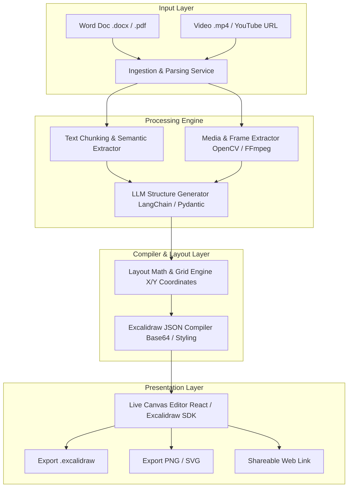

# 🚀 Doc2Draw AI: End-to-End Product Blueprint & Implementation Roadmap

> **Turn Word Documents, PDF Notes, and Video Courses into Stunning, Interactive Excalidraw Visual Maps in Seconds.**

---

## 📋 Executive Summary & Product Vision

**Doc2Draw AI** (working title) is an AI-powered document-to-diagram visualization platform designed for course creators, technical writers, consultants, and educators. 

Currently, converting unstructured text (like Word documents, course transcripts, or technical specifications) into structured, visually engaging diagrams requires hours of manual drafting, layout alignment, and design tweaking. **Doc2Draw AI** automates this entire pipeline by combining intelligent document parsing, video/image extraction, LLM-powered semantic layout structuring, and programmatic Excalidraw JSON compilation.

### ✨ Key Value Propositions
* **⚡ 10x Faster Content Creation:** Convert a 30-page course blueprint into a 10-chapter interactive visual map in under 60 seconds.
* **🎨 Studio-Grade Aesthetics:** Automated color harmony, typography pairing, grid alignment, and visual containerization that looks like it was designed by a professional UI/UX architect.
* **🖼️ Multimodal Asset Integration:** Automatically extract key video frames or embed reference screenshots directly onto the visual canvas.
* **🔗 Universal Compatibility:** Export natively to `.excalidraw` (editable), high-resolution `.png`, `.svg`, or shareable interactive web links.

---

## 🎯 Target Audience & Use Cases

| Target Segment | Pain Point | How Doc2Draw AI Solves It |
| :--- | :--- | :--- |
| **🎓 Course Creators & Educators** | Need visual summaries and cheat sheets for masterclasses but lack design time/skills. | Ingests course syllabus/transcripts (`.docx`) and lecture videos (`.mp4`) to auto-generate complete chapter-by-chapter visual maps. |
| **🏗️ Solution Architects & Devs** | Technical specs and PRDs are dense and hard for stakeholders to digest quickly. | Converts PRDs, technical RFCs, and architecture docs into clean system architecture diagrams and flowcharts. |
| **📊 Business Analysts & PMs** | Meeting notes and process documentation get buried in text files. | Transforms SOPs (Standard Operating Procedures) and workflow documents into swimlane diagrams and step-by-step visual process pipelines. |
| **💼 Agencies & Consultants** | Spending unbillable hours building client slide decks and visual roadmaps. | Instantly generates client-ready visual roadmaps and strategic framework diagrams from rough discovery call notes. |

---

## 🏛️ System Architecture & Data Pipeline

The product operates as a multi-stage asynchronous processing pipeline that transforms raw unstructured files into validated, pixel-perfect Excalidraw JSON schemas.



---

## 🛠️ Recommended Technology Stack

We recommend a modern, scalable, serverless-friendly architecture that separates the heavy media/document processing from the fast frontend web interface.

### 1. Frontend & Web Application
* **Framework:** **Next.js 14+ (App Router)** with **TypeScript** and **Tailwind CSS**.
* **UI Components:** **Shadcn UI** + **Lucide Icons** + **Framer Motion** (for smooth animations).
* **Canvas Integration:** `@excalidraw/excalidraw` React SDK (for live interactive preview and canvas editing).
* **State Management:** **Zustand** or **React Query** (TanStack Query) for asynchronous job tracking.

### 2. Backend & API Layer
* **API Server:** **FastAPI (Python 3.11+)** — Python is essential here due to superior libraries for document parsing (`python-docx`), image/video processing (`opencv-python`, `ffmpeg-python`), and AI orchestration.
* **LLM Orchestration:** **LangChain** or **LlamaIndex** + **Instructor / Pydantic** (for enforced structured JSON outputs from LLMs).
* **AI Models:** 
  * **Primary Reasoning & Structuring:** Anthropic **Claude 3.5 Sonnet** or OpenAI **GPT-4o** (best at spatial reasoning and structured JSON formatting).
  * **Fallback / Fast Tasks:** Google **Gemini 1.5 Pro** / **Flash** (excellent for long-context document ingestion).

### 3. Database, Storage & Background Jobs
* **Database & Auth:** **Supabase (PostgreSQL)** — handles user authentication, row-level security, and storing project metadata/histories.
* **File Storage:** **Supabase Storage** or **AWS S3 / Cloudflare R2** (for storing uploaded `.docx`, video files, and generated screenshot thumbnails).
* **Job Queue:** **Inngest** or **Celery + Redis** — document parsing, video frame extraction, and LLM schema generation take 20–60 seconds; asynchronous background processing is mandatory.

---

## ⚙️ Core Modules & Functional Specifications

### Module 1: Intelligent Ingestion & Extraction (`/services/ingestion`)
* **Text Parser:** Extracts headings (`H1`, `H2`, `H3`), bullet lists, bold emphasis, and tables from `.docx` and `.pdf` files while preserving hierarchical context.
* **Media Processor:** 
  * Accepts `.mp4` uploads or video URLs.
  * Calculates video duration and extracts frames at evenly distributed percentage intervals (e.g., 10%, 25%, 50%, 75%, 90%) or based on scene-change detection.
  * Resizes and compresses screenshots to optimal dimensions (e.g., max width 800px) and converts to JPEG quality 85 to keep JSON payload sizes lightweight.

### Module 2: AI Semantic Structuring Engine (`/services/ai`)
Instead of asking an LLM to generate raw Excalidraw coordinates directly (which LLMs struggle with due to spatial math limitations), we prompt the LLM to output a **Semantic Diagram Tree**.

> [!IMPORTANT]
> **Key Design Pattern:** The LLM decides *WHAT* to draw and *HOW they relate* (Chapters, Topics, Arrows, Cards). Our deterministic Python Layout Engine decides *WHERE* to draw them (exact X, Y coordinates, widths, and heights).

#### Pydantic Schema for LLM Output:
```python
from pydantic import BaseModel, Field
from typing import List, Optional

class DiagramItem(BaseModel):
    id: str = Field(..., description="Unique identifier, e.g., 'item_1'")
    title: str = Field(..., description="Short title or heading of the card")
    bullet_points: List[str] = Field(..., description="3 to 5 key takeaway points")
    category_color: str = Field(..., description="Color theme: 'blue', 'green', 'purple', 'orange', 'red'")
    connected_to: Optional[List[str]] = Field(default=[], description="IDs of items this should connect to via arrows")
    screenshot_ref: Optional[str] = Field(default=None, description="Name of associated screenshot if applicable")

class DiagramStructure(BaseModel):
    title: str = Field(..., description="Main title of the entire masterclass/document")
    subtitle: str = Field(..., description="One-line summary subtitle")
    layout_style: str = Field(..., description="Layout type: 'multi_column_grid', 'flowchart_pipeline', 'mindmap_tree'")
    items: List[DiagramItem]
```

### Module 3: Deterministic Layout & Coordinate Math Engine (`/services/layout`)
Takes the structured JSON from the LLM and calculates exact coordinates without overlap:
1. **Grid Calculation:** For a `multi_column_grid` (like our courses), divides items into 3 vertical columns with `COLUMN_WIDTH = 450`, `COLUMN_GAP = 80`, and `ROW_GAP = 60`.
2. **Dynamic Height Calculation:** Calculates container height dynamically based on the number of bullet points and text wrapping lines: `height = 80 + (num_lines * 24) + padding`.
3. **Arrow Routing:** Automatically computes start and end points between bounding boxes (`start_x = box1.x + box1.width`, `end_x = box2.x`), adding elegant curved routing (`roundness: { type: 2 }`).
4. **Asset Binding:** Converts local/stored screenshot images into Base64 strings and injects them into the Excalidraw `files` dictionary with generated `fileId` references.

### Module 4: Excalidraw JSON Compiler (`/services/compiler`)
Compiles all calculated elements into the standard Excalidraw JSON structure:
```json
{
  "type": "excalidraw",
  "version": 2,
  "source": "https://doc2draw.ai",
  "elements": [ ... ],
  "appState": {
    "viewBackgroundColor": "#ffffff",
    "gridSize": 20,
    "theme": "light"
  },
  "files": {
    "file_id_1": {
      "mimeType": "image/jpeg",
      "id": "file_id_1",
      "dataURL": "data:image/jpeg;base64,/9j/4AAQSkZJRg..."
    }
  }
}
```

---

## 🗺️ Step-by-Step Implementation Roadmap

### 🏁 Phase 1: Core Engine & CLI MVP (Weeks 1 – 2)
* [x] **Step 1.1:** Standardize existing Python scripts (`process_make_com.py`, `generate_*_excalidraw.py`) into a clean, modular Python package (`doc2draw-core`).
* [ ] **Step 1.2:** Implement robust `.docx` and `.pdf` parsing utilities using `python-docx` and `pypdf`/`pdfplumber`.
* [ ] **Step 1.3:** Build the Pydantic schema and integrate LangChain/Instructor with Claude 3.5 Sonnet to auto-extract chapters from any arbitrary document.
* [ ] **Step 1.4:** Create automated unit tests that verify generated `.excalidraw` files pass Excalidraw schema validation without errors.

### 🌐 Phase 2: Backend API & Background Workers (Weeks 3 – 4)
* [ ] **Step 2.1:** Initialize FastAPI project with endpoints:
  * `POST /api/v1/projects/upload` — Ingests `.docx` and video files.
  * `POST /api/v1/projects/generate` — Triggers background generation job.
  * `GET /api/v1/projects/{job_id}/status` — Returns job progress (Parsing -> Extracting Media -> AI Structuring -> Compiling).
  * `GET /api/v1/projects/{project_id}/excalidraw` — Returns compiled JSON.
* [ ] **Step 2.2:** Set up Redis and Celery (or Inngest) to handle heavy video frame extraction and LLM calls asynchronously without timing out HTTP requests.
* [ ] **Step 2.3:** Integrate Supabase Storage for secure file uploads and persistent asset storage.

### 💻 Phase 3: Full-Stack Web Application (Weeks 5 – 6)
* [ ] **Step 3.1:** Scaffold Next.js 14 App Router project with Tailwind CSS and Shadcn UI.
* [ ] **Step 3.2:** Build the **Project Dashboard** and **New Project Wizard** (Drag-and-drop file upload, layout style selector, color palette selector).
* [ ] **Step 3.3:** Embed the live Excalidraw React component (`@excalidraw/excalidraw`) on the result page, allowing users to interactively tweak, drag, and edit the generated diagram directly in their browser!
* [ ] **Step 3.4:** Implement 1-click Export buttons (Download `.excalidraw`, Download High-Res PNG, Copy Shareable Web Link).

### 🚀 Phase 4: Monetization, Polish & Launch (Weeks 7 – 8)
* [ ] **Step 4.1:** Integrate Stripe Checkout & Webhooks for subscription billing.
* [ ] **Step 4.2:** Add user authentication and workspace management via Supabase Auth (Google OAuth + Magic Links).
* [ ] **Step 4.3:** Build a **"Template Library"** showcasing pre-made visual maps (e.g., Course Roadmap, SaaS Architecture, Marketing Funnel, SOP Pipeline).
* [ ] **Step 4.4:** Prepare Product Hunt launch assets, demo videos, and landing page SEO optimization.

---

## 💎 Monetization & Pricing Strategy (SaaS Tiers)

| Tier | Price | Features & Usage Limits | Target User |
| :--- | :--- | :--- | :--- |
| **🌱 Starter (Free)** | **$0 / mo** | • 3 Diagrams / month<br>• Word & Text upload only<br>• Standard Grid Layout<br>• Community Support | Casual users & students trying out the tool. |
| **🚀 Creator Pro** | **$19 / mo** | • **Unlimited Diagrams**<br>• Video & Screenshot extraction (up to 500MB)<br>• All Layout Styles (Mindmap, Flowchart, Grid)<br>• Custom Branding & Colors<br>• High-Res PNG & SVG Export | Course creators, YouTubers, and technical consultants. |
| **🏢 Team & Agency** | **$49 / mo** | • Everything in Pro<br>• 5 Team Member seats<br>• Shared Workspace & Template Library<br>• Priority Background Processing<br>• API Access (1,000 req/mo) | Agencies, ed-tech startups, and documentation teams. |

---

## 🔮 Future Enhancements & Vision (V2 & Beyond)

1. **🔄 Bi-Directional Sync (Draw-to-Doc):**
   * Imagine dragging boxes and changing text in the Excalidraw canvas, and clicking "Sync to Word" — the AI automatically updates the underlying `.docx` or Notion page to reflect your visual changes!
2. **🎙️ Voice & Meeting to Diagram:**
   * Integrate Whisper API to ingest Zoom meeting recordings or voice memos and instantly spit out an actionable visual workflow diagram.
3. **🔌 VS Code Extension & MCP Server:**
   * Build a Model Context Protocol (MCP) server so developers using Claude Desktop or Cursor can say: *"Analyze my repository architecture and generate an Excalidraw diagram in my workspace"* — instantly bridging code to visual maps!

---
*Blueprint generated by Antigravity AI — Built for scale, aesthetic excellence, and rapid execution.*
